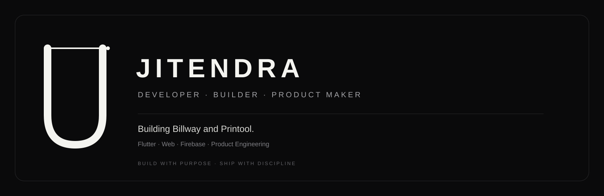

 

### PRODUCT BUILDER · SOFTWARE · SYSTEMS

I build practical software products — from mobile applications and web tools to larger business systems.

 

<a href="https://github.com/jkchy2001?tab=repositories">Repositories</a>
&nbsp;&nbsp;·&nbsp;&nbsp;
<a href="https://github.com/jkchy2001?tab=stars">Stars</a>

 

---

## Currently building

<table>
<tr>
<td width="70%">

### ToolMay

A business software platform designed around the everyday workflow of small and growing businesses.

**Focus**

Inventory · Billing · Customers · Vendors · Reports · GST · Accounting · Offline-first workflows

**Stack**

`Flutter` `Dart` `Firebase`

</td>
<td width="30%" align="center">

**BUILDING**

`████████░░`

</td>
</tr>
</table>

---

## Selected work

<table>
<tr>

<td width="33%" valign="top">

### LabelMaker

Tools for creating and managing labels, including barcode and QR-based workflows.

`Python`

**→** [View repository](https://github.com/jkchy2001/Labelmaker)

</td>

<td width="33%" valign="top">

### Light Crew

A web-based project exploring modern application interfaces and workflows.

`TypeScript`

**→** [View repository](https://github.com/jkchy2001/Light-crew)

</td>

<td width="33%" valign="top">

### Bajao

A Flutter-based application experiment focused on mobile product development.

`Dart`

**→** [View repository](https://github.com/jkchy2001/Bajao)

</td>

</tr>
</table>

---

## What I work with

<table>
<tr>
<td valign="top">

**Mobile**

Flutter  
Dart  
Android

</td>

<td valign="top">

**Web**

React  
TypeScript  
JavaScript  
Next.js

</td>

<td valign="top">

**Backend**

Firebase  
APIs  
Cloud services

</td>

<td valign="top">

**Tools**

Git  
GitHub  
VS Code  
Android Studio

</td>
</tr>
</table>

---

## Building philosophy

> **Useful beats impressive.**  
> **Simple beats complicated.**  
> **Shipped beats perfect.**

I like software that solves an actual problem, stays understandable as it grows, and doesn't make the user think about the machinery underneath.

---

## GitHub

 

---

### BUILD · SHIP · REFINE

 

Software should feel simpler than the engineering behind it.

