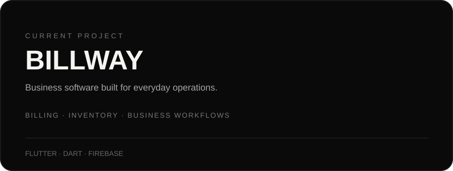
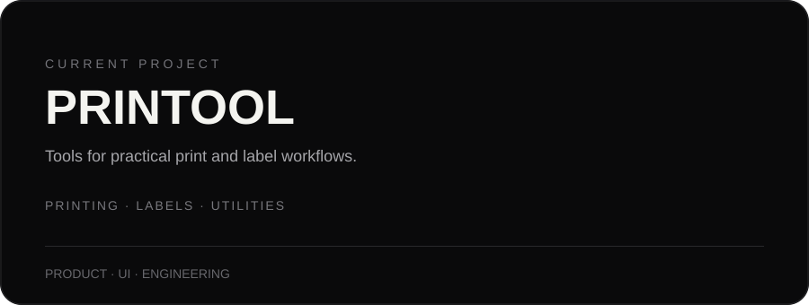
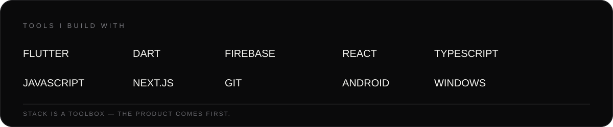

<div align="center">


<br><br>

**DEVELOPER · BUILDER · PRODUCT MAKER**

I like turning ideas into software that people can actually use.

<br>

[](https://github.com/jkchy2001)
[](https://github.com/jkchy2001?tab=repositories)

</div>

<br>


## What I'm building

Right now, most of my attention is going into two products.

<table>
<tr>
<td width="50%" valign="top">



</td>
<td width="50%" valign="top">



</td>
</tr>
</table>

I'm interested in the part of software where **product thinking, interface design and engineering meet** — taking a rough idea and gradually turning it into something reliable.

<br>

## How I work

```text
IDEA
  ↓
EXPLORE
  ↓
DESIGN
  ↓
BUILD
  ↓
TEST
  ↓
REFINE
  ↓
SHIP
```

I don't want software to be complicated just because the problem is complicated.

The goal is simple:

> **Make the difficult parts invisible to the person using the product.**

<br>

## My toolbox



<br>

I primarily work across **Flutter, Dart, web technologies and Firebase**, while experimenting with whatever tools are useful for the problem in front of me.

<br>

## Projects

| Project | What it is |
|---|---|
| **Billway** | Business software I'm currently building |
| **Printool** | Printing and label-focused software I'm currently building |
| **LabelMaker** | An earlier project around label generation |
| **Light Crew** | Web/application experiment |
| **Bajao** | Mobile application experiment |

→ [Explore all repositories](https://github.com/jkchy2001?tab=repositories)

<br>

## A little about me

I'm interested in **software products, automation, interfaces and the systems underneath them**.

I enjoy starting with something that doesn't exist, figuring out how it should work, and then slowly turning that idea into a real product.

I'm still learning.  
I'm still experimenting.  
And I'm still building.

That's kind of the point.

<br>

## GitHub activity

<div align="center">


<br><br>


</div>

<br>


<div align="center">

### BUILD · LEARN · REFINE · SHIP

<br>

<sub>Still figuring things out. Still making things better.</sub>

<br><br>

<a href="https://github.com/jkchy2001">GitHub</a>
&nbsp;&nbsp;·&nbsp;&nbsp;
<a href="https://github.com/jkchy2001?tab=repositories">Projects</a>

</div>
